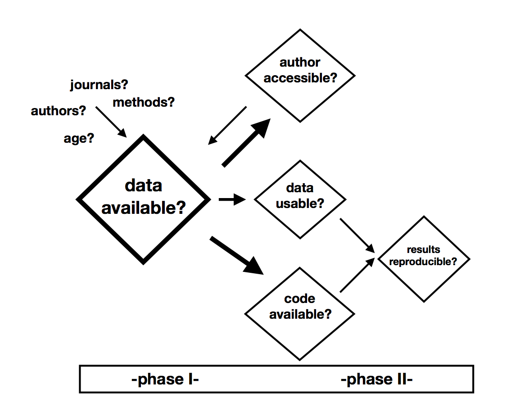

```{r setup, include=FALSE}
# Displays source code
knitr::opts_chunk$set(echo = TRUE)
```

```{r, echo = FALSE}
# Make code wrap text so it doesn't go off the page when Knitting to PDF
library(knitr)
opts_chunk$set(tidy.opts = list(width.cutoff = 60), tidy = TRUE)
```

*Submitted by:* 
Riana Minocher\*, Bret Beheim, Silke Atmaca, Corina Logan, and Richard McElreath
\newline \*riana_minocher@eva.mpg.de

# Motivation

Reproducibility, the ability to reproduce results of published research using the data, methods and code of original analyses, is a criterion for responsible scientific output. Reproducibility differs from replication, which involves establishing scientific findings in an independent investigation of the same research question (@ihle2017credible, @patil2016statistical). Encouraging reproducible research practices deters scientific misconduct, increases engagement with research and improves productivity. Importantly, implementing a transparent and reproducible workflow reduces time spent in data organisation and streamlines collaboration, thus improving output within research groups (@lowndes2017open). Reproducible research is published alongside available data and transparent methods, providing the potential for full analysis reproduction with executable analytical code. 

Surveys across scientific disciplines have found reproducibility of original work to be low (30-60%), due to inaccessible authors and data (@vines2014age, @teunis2015responsibility) and improper use of software or methods (@gilbert2012structure). Reproducibility generally improves when data and code are available (@peng2011computational) and when code is executable (@gertler2018norm). We aim to quantify the extent of scientific reproducibility within the field of evolutionary anthropology. Focussing on empirical social learning work, we will integrate these findings to identify, improve and implement reproducible research methods to study social learning.

# Context

Social learning, the mechanisms by which social information or behavioural traits, are acquired, used, and diffused among conspecifics, is a topic of long-standing interdisciplinary interest and controversy. Thus, a dense body of empirical research has been contributed to for over 30 years by disciplines including psychology, sociology, economics, anthropology and archaeology. This work has traditionally involved a wide range of study species, from humans and non-human primates, to birds, fish and cetaceans. Selecting a literature that is of interdisciplinary interest is critical, as we aim to demonstrate the state of reproducibility and importance of good scientific practices to a wide and growing audience. 

Previous investigations identify a number of factors associated with low reproducibility. For example, the probability of data availability (@vines2014age) and author accessibility via email (@teunis2015responsibility) decreases with age of publication, while age has no relationship with reproducibility when data is available (@andrew2015dfa). Journal data policies, such as mandated data statements, may increase odds of finding data online (@savage2009sharing). Furthermore, some types of software, analysis pipelines or coding language may be less stable than others (e.g. @andrew2015dfa); methods should be implemented properly and documented clearly (@gilbert2012structure). The degree of information reported in published work is often not sufficient for supplementary work, such as meta-analyses (@manca2018meta). 

The nature of the data and analyses in empirical social learning work lend themselves to unique considerations about data availability and sensitivity: experimental data on human subjects could often be confidential, yet is usually collected for a single purpose with design, and is thus complete, prepared for analysis, easy to share and unlikely to be reused by the same research group. However, we do not expect that our sample should have higher rates of reproducibility than other studies have found. In fact, we are not aware of traditions of collaborative data sharing practices within these disciplines, and consider the possibility that data and analyses may often go undocumented. 

# Research questions

We aim to identify the state of data availability, author accessibility and scientific reproducibility of empirical research on social learning. We will do this by assessing several questions:

1) What proportion of social learning research is published with publicly available data?

2) When data is available on request from authors, are authors accessible?

3) Are accessible authors able/ willing to share data?

3) When data is available online or through request, is it usable, on inspection, for reproducing analyses?

4) Is analytical code available?

5) When data and analytical code are available, are the original research results reproducible?

6) Is there any influence of journal data policy on the availability of data and author willingness to share data?

7) Is there any effect of author ID on data availability - i.e. do reproducibility 'norms' exist?

8) Does age of research influence data availability and scientific reproducibility?

9) Is the methodological approach associated with reproducibility?

# Methods

We will quantify the proportions of the sample we find at each stage of our study (Figure 1). During Phase I of this outline, we will be assessing data availability, author accessibility, availability of data through request, data usability and access to analytical code. In Phase II we will attempt to reanalyse research with a set of reproducibility criteria defined by the set of publications we will work with. At this point, we expect to identify the precise research methods that increase scientific reproducibility. We have planned the study in two phases because we are aware Phase II demands a greater investment of time and resources, and must be limited to a subset of publications. We apply a "reasonable researcher" criteria, given that there are always ways to improve reproducibility with more effort, but diminishing returns as effort increases. We will thus document when we succeeded because we persisted beyond the point most researchers would, and we will report results at each stage with mention of the effort required to obtain materials.

{width=70%}

### Planned sample

We focus on the subset of literature within evolutionary anthropology that fits the criteria "observational or experimental social learning". This broadly includes empirical work that involves social learning or diffusion of social information, across any species. We expect to include as much relevant literature in this study as possible for Phase I - we thus have no planned sample size and will continue to collect data until July 2018. Papers assessed during Phase II will be a subsample based on data availability and author accessibility during Phase I.

### Data collection

PHASE I:
Data for the first phase of our study will be collected in three parts:

1. Fetching:

We are collecting information on relevant literature through a variety of sources, including published reviews on social learning, keyword searches on google scholar/ web of science, and personal and public requests to researchers. This information is used to download PDFs of publications.

2. Scraping:

We record article and author metadata, and download bibliographic citations. We will produce and publish a bibliographic database for this literature. 

3. Digging:

When supplementary materials are published alongside the research article, we download and store them with metadata and citation. We will search for and record statements about further availability of materials, including raw data, processed data and code for analysis and data processing, in the published article and on the webpage of the publication. If data and/or code are available online, we will record the link and download and store the materials with metadata, citation and supplementary materials. 

We will source contact information for corresponding authors by performing a google search for updated information from the author's own website if existing, or an institutional website, after verifying that the author is currently present there. Alternatively, we will use the email address printed in the most recent paper published by the same author, i.e. disregarding older correspondence addresses. We will email corresponding authors to request data and code. Here, we plan to email authors who have stated data is available on request, as well as authors who have made no materials availability statements, but will report the outcomes of these two investigations separately. 

For each relevant publication, we aim to collect a pdf of the article, a citation, available supplementary materials, data and analysis code. 

PHASE II:
Data for our second phase will be the output of reproducing a subset of studies. We will begin this phase when we have contacted all authors for materials.

We will attempt to reproduce results of publications in R when original raw data is available, either online or sourced from authors. We expect to divide publications into three categories based on extent of materials available - i) raw or processed data available and methods described, ii) raw data and code in non-R format available, and iii) raw data and R code for processing and analysis available. In all cases, we will compare our reproduction of findings to the claims of the original publication, to make a qualitative assessment about whether the results remain valid. To do this, we will first summarise the key findings of each publication within this sample, before attempting reproduction. We will also record information about the type of analysis, including approach, statistical software used, and degree of statistical information reported. We expect we will need to focus the reproduction on a set of specific criteria for analyses, to maintain comparability across studies. This will depend on the final sample of publications with available materials. We will update our preregistration when we have this sample and before conducting our analyses.

### Data exclusion criteria

We plan to categorise all studies according to author accessibility, data availability, code availability and scientific reproducibility. We will only attempt to reproduce results if data and/ or code are available, and usable. If data are missing or incorrectly annotated, we will not attempt to reproduce results, but record this. 

### Letter template

Dear Dr./ Mr./ Ms. AUTHOR NAME,

My name is YOUR NAME and I am contacting you as part of the Evolutionary Anthropology Reproducibility Study (EARS), based at the Max Planck Institute for Evolutionary Anthropology.

We are assessing the reproducibility of scientific work in evolutionary anthropology, measuring how often published results can be reproduced using their original data, code, and methods. A working pre-registration of our first study is available at https://rianaminocher.github.io/ears/.

For our first investigation, we are focusing on empirical work in social learning, both observational and experimental. As such, your YEAR study with CO-AUTHORS (FULL NAMES), TITLE (CITATION KEY), published in JOURNAL, has been included in our starting sample.

We have looked online, but have not been able to find data or analysis code to accompany this paper. We would very much appreciate if you could share your data with us for this reproducibility study. If you also have code or scripting used for your analysis, this will help us in our attempt to reproduce your work.

All these materials and correspondences will remain private among members of EARS project, but we are planning to develop a redacted database from our collected materials and will contact you at a later date for your permission.

If you are unable to share the data and code with us, please let us know why, e.g. data is not readily available, or is lost, or is confidential. We understand that data in such studies can be confidential, and if this is the case, would like to know more about the nature of your ethical obligations. As part of our project, we are working on developing ways that sensitive data could be shared to aid scientific reproducibility, while protecting participants' information.

Thank you for your time, and please let us know if you have any questions. We're all EARS! (We're looking forward to your response).

Sincerely,

Evolutionary Anthropology Reproducibility Study

# Planned project output

1. Complete bibliography of empirical social learning literature
2. Database of reproducible social learning work, including data, supplementary materials and analytical code in R
3. Published report on state of data availability, author accessibility and scientific reproducibility of empirical research on social learning

# References